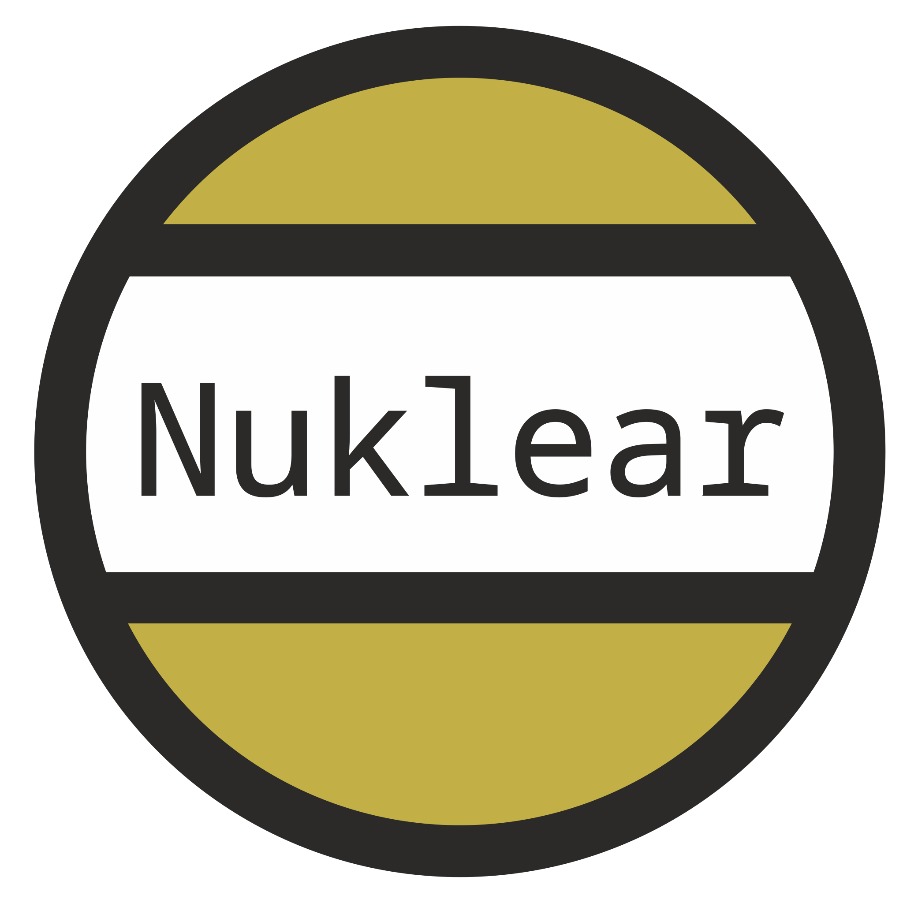

<div style="text-align:center"><a href="https://github.com/rjopek/hb-X11"></a></div>
---

# Harbour Nuklear backend

This backend provides support for [Nuklear](https://github.com/Immediate-Mode-UI/Nuklear). It works on on all supported platforms with an OpenGL backend, including iOS and Android. Demo version.

## How to Build

```
hbmk2 hbX11.hbp
```

[License]([LICENSE](https://github.com/rjopek/hb-X11/blob/main/LICENSE)) is obviously applied only for this repository, not what it builds.
